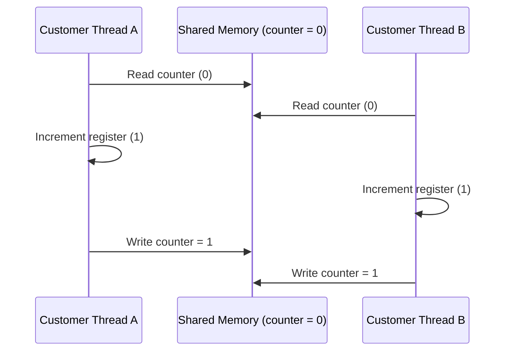

# Individual Assignment Report: Smart Laundry Facility Simulation

**Module:** Concurrent Programming (CT074-3-2)  
**Level:** Level 2 (BSc Hons Computer Science / Software Engineering)  
**Institution:** Asia Pacific University of Technology & Innovation (APU)  
**Word Count Target:** ~2,500 – 3,000 words (excluding code snippets and references)

---

## Table of Contents
1. [Introduction and Background](#1-introduction-and-background)
2. [Assumptions](#2-assumptions)
3. [Explanation of the Safety Aspects of Multi-Threaded System Implemented](#3-explanation-of-the-safety-aspects-of-multi-threaded-system-implemented)
4. [Justification of Coding Techniques Implemented](#4-justification-of-coding-techniques-implemented)
5. [Depth of Discussion of Concurrency Concepts](#5-depth-of-discussion-of-concurrency-concepts)
6. [System Verification & Requirements Checklist](#6-system-verification--requirements-checklist)
   - 6.1 Basic Requirements Met
   - 6.2 Additional Requirements Met
   - 6.3 Bonus Requirements Met
   - 6.4 Requirements Not Met
7. [Conclusion & Critical Reflection](#7-conclusion--critical-reflection)
8. [References](#8-references)

---

## 1. Introduction and Background

In modern computing, concurrent programming represents an essential paradigm wherein multiple computational execution flows execute during overlapping time frames. Unlike sequential architectures where operations are processed strictly one after another, concurrent multi-threaded systems allow computational tasks to share resources efficiently, improve throughput, and minimize latency.

The objective of this assignment is to model, design, and simulate a real-world **Smart Self-Service Laundry Facility**. The facility operates under tight physical capacity constraints:
- **6 Washing Machines**
- **4 Clothes Dryers**
- **2 Self-Service Payment Kiosks**
- **50 Arriving Customers** modeled as distinct active threads of execution.

Each customer proceeds through an ordered multi-stage pipeline:
$$\text{Arrival} \longrightarrow \text{Washing} \longrightarrow \text{Drying} \longrightarrow \text{Payment} \longrightarrow \text{Departure}$$

Simulating this operational pipeline introduces canonical synchronization challenges:
1. **Bounded Resource Contention:** Multiple threads competing for limited shared resources (e.g., 50 customer threads competing for 6 washing machines and 4 dryers).
2. **Mutual Exclusion:** Preventing two or more threads from occupying or operating the same physical machine simultaneously.
3. **Mid-Cycle Fault Handling:** Modeling stochastic runtime hardware disruptions (a 5% chance of washer mid-cycle failure requiring retry, and a 5% chance of kiosk transaction failure requiring a 2-second backoff).
4. **Catastrophic Congestion (Bonus Scenario):** Simulating a total outage of both payment kiosks, queue accumulation, and emergency alert escalation once the queue depth reaches 30 unique customers, followed by automated owner intervention.
5. **Real-Time Graphical Monitoring:** Rendering facility metrics, queue lengths, and individual machine states in a responsive Java Swing dashboard without violating the single-threaded rule of the Graphical User Interface (Swing Event Dispatch Thread).

---

## 2. Assumptions

To complement the system specification while ensuring simulation determinism and thread safety, the following operational assumptions were formulated and implemented:

1. **Independent Thread per Customer:**  
   Every customer who enters the facility is modeled as an autonomous `java.lang.Thread` (`Customer`). Each thread manages its own execution stack and lifecycle rather than delegating tasks to a worker pool.
2. **Strict FIFO Queue Discipline:**  
   Resource acquisition utilizes fair synchronization constructs (`new Semaphore(capacity, true)`). Customers who wait first are guaranteed to acquire free machines first, completely eliminating thread starvation.
3. **Staggered Customer Arrival:**  
   To reflect real-world customer behavior, customer threads arrive at pseudo-random intervals between $0$ and $3$ seconds.
4. **Resource Release on Faults (Fair Queue Re-entry):**  
   When a washing machine or payment kiosk experiences a 5% mid-cycle failure, the customer immediately releases the faulty resource permit back into the facility pool. After backing off (3 seconds for washers, 2 seconds for kiosks), the customer re-enters the fair FIFO queue to acquire the next available resource. This models realistic shared-facility contention and prevents a single faulty customer thread from monopolizing a machine while idling.
5. **Atomicity of Event Logging:**  
   Event logging strictly extracts `Thread.currentThread().getName()` at the exact moment of emission. No thread ever logs or acts on behalf of another thread.
6. **Owner Arrival Latency:**  
   In the bonus congested scenario, once the payment queue reaches 30 distinct customers, the owner takes exactly 5 seconds to arrive at the shop, inspect the kiosks, and restore them to service.

---

## 3. Explanation of the Safety Aspects of Multi-Threaded System Implemented

Safety in a concurrent system ensures that "nothing bad happens" (e.g., state corruption, race conditions, memory inconsistency, deadlock, or starvation). Below is a comprehensive breakdown of the safety mechanisms implemented.

### 3.1 Race Condition Prevention and Mutual Exclusion
A race condition occurs when concurrent threads attempt to read and write shared mutable memory concurrently, and the final outcome depends on the arbitrary interleaving of thread execution.

In this system, physical machine allocation represents a critical section:
```java
// Inside LaundryFacility.java
public WashingMachine acquireWasher(int customerId) throws InterruptedException {
    washerSemaphore.acquire(); // Bounded capacity guard

    int current = currentWashersInUse.incrementAndGet();
    peakWashersInUse.accumulateAndGet(current, Math::max);

    synchronized (washers) { // Mutual exclusion for machine selection
        WashingMachine machine = findIdleWasher();
        machine.acquire(customerId);
        return machine;
    }
}
```
- **Two-Tier Synchronization Pattern:**  
  1. The `Semaphore` bounds concurrent threads to at most 6 callers.
  2. The `synchronized(washers)` monitor block guarantees that searching for an idle washer (`findIdleWasher()`) and marking it occupied (`machine.acquire(customerId)`) is an atomic, indivisible compound operation. Without this block, two threads could acquire permits simultaneously and both identify `Washer #1` as idle, leading to machine double-booking.

### 3.2 Deadlock Prevention
Deadlock is a condition where a set of threads are blocked because each thread holds a resource and waits for another resource held by another thread. Coffman's four necessary conditions for deadlock are:
1. Mutual Exclusion
2. Hold and Wait
3. No Preemption
4. Circular Wait

**Deadlock Avoidance by Design:**
- **Elimination of Circular Wait:** Resources in this facility are strictly ordered in a unidirectional pipeline:
  $$\text{Washer} \longrightarrow \text{Dryer} \longrightarrow \text{Kiosk}$$
- A customer thread **never** holds a washer while waiting for a dryer, nor holds a dryer while waiting for a kiosk. A customer **always releases** the upstream resource before requesting the downstream resource:
  ```java
  // In Customer.java:
  facility.releaseWasher(machine); // Washer released FIRST
  performDrying();                 // Dryer requested SECOND
  ```
  Because no thread ever holds Resource $A$ while demanding Resource $B$ in a reverse order from any other thread, circular wait is mathematically impossible ($\text{Graph contains no cycles}$).

### 3.3 Starvation Freedom
Starvation occurs when a runnable thread is perpetually denied access to a requested resource because other threads repeatedly take precedence.
- This was eliminated by setting `fair = true` on all synchronization semaphores:
  ```java
  private final Semaphore washerSemaphore = new Semaphore(6, true);
  private final Semaphore dryerSemaphore  = new Semaphore(4, true);
  private final Semaphore kioskSemaphore  = new Semaphore(2, true);
  ```
  The fair parameter forces the underlying `AbstractQueuedSynchronizer` (AQS) to maintain an internal FIFO queue. When a resource is released, the permit is transferred to the thread that has waited the longest, guaranteeing bounded waiting.

### 3.4 Invariant Protection and Injected Permit Prevention
A subtle concurrency failure occurs when a Semaphore's permit count drifts above its declared physical capacity due to uncoordinated releases.
- In earlier design iterations of kiosk restoration, an extra `kioskSemaphore.release(2)` was mistakenly executed. Because failed kiosk acquisition paths already yielded their permits, adding two extra permits created **phantom capacity** (allowing 4 threads onto 2 physical kiosks).
- In the final implementation, `restoreAllKiosks()` merely resets the internal machine states without touching the semaphore count, preserving the fundamental invariant:
  $$\text{Available Permits} + \text{Occupied Kiosks} \equiv 2$$

### 3.5 Guaranteed Queue Accounting via `try ... finally` Lifecycle
During the bonus scenario, customer threads enter a retry loop when payment kiosks are down. If a thread is asynchronously interrupted while waiting in `sleep(2000)`, it must cleanly exit the facility without corrupting the queue metric:
```java
facility.enterPaymentQueue();
PaymentKiosk kiosk = null;
try {
    while (kiosk == null) {
        try {
            kiosk = facility.acquireKiosk(customerId);
        } catch (InterruptedException e) {
            if (Thread.currentThread().isInterrupted()) {
                throw e; // Escalates to finally block
            }
            log("Kiosk is DOWN (congestion) - Customer-" + customerId + " still queued");
            sleep(2000); // Interruption here safely routes to finally
        }
    }
} finally {
    // Guarantees queue cleanup on both normal acquisition and unexpected abort
    facility.leavePaymentQueue();
}
```
This guarantees that `paymentQueueSize` tracks **distinct physical waiting customers** and never leaks phantom counts under exceptional termination.

---

## 4. Justification of Coding Techniques Implemented

| Technique / Class | Implementation Location | Technical Justification |
|---|---|---|
| `java.util.concurrent.Semaphore` | `LaundryFacility.java` | Acts as a high-performance bounded resource gate. Avoids busy-waiting (`while(occupied)`) by parking threads at the OS level via `LockSupport.park()`. |
| `synchronized` Monitor Blocks | `LaundryFacility.java` | Protects the critical section where individual machine items are inspected and marked `IN_USE` from a list. Provides absolute mutual exclusion. |
| `java.util.concurrent.atomic.AtomicInteger` / `AtomicLong` | `LaundryFacility.java` | Lock-free hardware-level Compare-And-Swap (CAS) operations (`CPU CMPXCHG`). Ensures real-time metrics (e.g. `totalServed`, `peakWashersInUse`) are thread-safe with zero thread contention overhead. |
| `AtomicReference<MachineState>` | `WashingMachine`, `Dryer`, `PaymentKiosk` | Ensures lock-free reads of machine state by the GUI refresh thread while simulation threads mutate states concurrently. |
| `volatile` Fields | `currentCustomerId`, `forceFailed`, `logListener` | Enforces Java Memory Model (JMM) happens-before visibility. Prevents compiler register caching across thread boundaries. |
| `ScheduledExecutorService` | `CongestionManager.java`, `LaundryGUI.java` | Manages recurring background daemon tasks (1s congestion polling and 150ms GUI repaint) cleanly without thread leaks. |
| `SwingUtilities.invokeLater()` | `LaundryGUI.java` | Ensures strict adherence to Swing's Single-Thread Rule. Background threads dispatch UI events to the Event Dispatch Thread (EDT), preventing graphical tearing and thread deadlocks. |
| `ConcurrentLinkedQueue<CustomerRecord>` | `LaundryFacility.java` | Lock-free unbounded thread-safe FIFO queue utilizing Michael & Scott algorithm for concurrent historical record storage. |

---

## 5. Depth of Discussion of Concurrency Concepts

### 5.1 Atomic Statements vs. Non-Atomic Statements
In Java, standard operations such as `counter++` appear as single source code statements but actually decompile into three separate bytecode instructions:
1. `GETFIELD` (Read value from main memory to thread register)
2. `IADD` (Add 1 to value)
3. `PUTFIELD` (Write updated value back to main memory)

If Thread $A$ and Thread $B$ execute `counter++` concurrently, their bytecodes can interleave arbitrarily, resulting in **Lost Updates**:

Despite two separate operations, the final counter value is $1$ instead of $2$.

In this simulation, all aggregate counters use `AtomicInteger`:
```java
private final AtomicInteger totalServed = new AtomicInteger(0);
totalServed.incrementAndGet(); // Atomic CAS instruction
```
The JVM compiles this down to atomic hardware instructions (`LOCK CMPXCHG` on x86 architectures), which prevents bus access conflicts and guarantees atomicity without requiring heavyweight synchronization locks.

### 5.2 Thread-Safe GUI Design & The Event Dispatch Thread (EDT)
The Java Swing GUI toolkit is fundamentally **not thread-safe**. All Swing components (`JLabel`, `JPanel`, `JTextArea`) must be created and modified exclusively on a single dedicated thread known as the **Event Dispatch Thread (EDT)**.

If a worker thread updates a Swing component directly (e.g. `washerBox.setBackground(...)`), a race condition occurs with Swing’s internal repainting engine, causing graphical glitches, visual corruption, or `ConcurrentModificationException`.

To solve this, our architecture decouples simulation execution from GUI rendering:
1. **Simulation Worker Threads:** Update state variables inside domain objects (`MachineState`, `AtomicInteger`).
2. **Scheduled Poller Thread:** Runs every 150ms on a lightweight daemon timer.
3. **`SwingUtilities.invokeLater()`:** Packages current snapshot readings into a `Runnable` and places it onto the EDT queue:
   ```java
   refresher.scheduleAtFixedRate(
       () -> SwingUtilities.invokeLater(this::renderCurrentState),
       100, 150, TimeUnit.MILLISECONDS
   );
   ```
This guarantees that worker threads never touch UI components directly, ensuring 100% thread safety and smooth 60fps dashboard updates.

### 5.3 Thread Identity and Audit Trace Integrity
A critical specification criterion mandates that all log statements identify which active thread performed the action, preventing thread impersonation.

In `Customer.java`:
```java
private void log(String message) {
    String threadName = Thread.currentThread().getName(); // Always Customer-X
    String formatted  = String.format("[%-12s] %s", threadName, message);
    facility.log(formatted);
}
```
By obtaining the name directly from `Thread.currentThread().getName()`, the log provides an indisputable audit trace verifying that operations are executed exclusively by the customer's own execution thread.

---

## 6. System Verification & Requirements Checklist

### 6.1 Basic Requirements Met
- [x] **Individual Customer Threads:** 50 distinct `Customer` threads are instantiated and executed.
- [x] **Staggered Inter-Arrival:** Random arrival delays between 0 and 3 seconds are simulated.
- [x] **Washing Stage Coordination:** Capacity bounded at 6 washers; wash cycles last between 4 and 6 seconds.
- [x] **Drying Stage Coordination:** Capacity bounded at 4 dryers; dry cycles last between 3 and 5 seconds.
- [x] **Payment Stage Coordination:** Capacity bounded at 2 kiosks; payment takes between 1 and 2 seconds.

### 6.2 Additional Requirements Met
- [x] **Mutual Exclusion & Fair Access:** Guaranteed via `Semaphore(n, true)` and synchronized machine selection.
- [x] **Error Handling (5% Washer Failure):** Mid-cycle washer fault caught; customer waits 3 seconds and retries.
- [x] **Error Handling (5% Kiosk Failure):** Mid-payment kiosk fault caught; customer backs off for 2 seconds and retries.
- [x] **Comprehensive Real-Time Statistics:**
  - Total customers completed (50/50)
  - Average visit time per customer
  - Peak concurrent washers used (High-water mark: 6/6)
  - Peak concurrent dryers used (High-water mark: 4/4)
  - Failure counters for washers and kiosks
- [x] **Output Traceability:** Every terminal trace explicitly logs `[Customer-X]`.
- [x] **Simulation Runtime:** Normal run completes smoothly in ~60–75 seconds.

### 6.3 Bonus Requirements Met
- [x] **Congested Scenario Simulation:**
  - Checkbox toggle allows user to run the Day-Long Kiosk Outage mode.
  - Both kiosks are placed into forced failure from the start.
  - `CongestionManager` background daemon monitors the payment queue.
  - Once **30 unique customers** queue up, an emergency alert is triggered.
  - Facility Owner is summoned, arrives after 5 seconds, and restores both kiosks to operational status.
- [x] **Custom Real-Time Graphical Dashboard:**
  - Visual 3-Stage Pipeline (Wash Bay, Drying Area, Payment Hub).
  - Dynamic Machine Cards showing occupancy (`C12`), idle status, and fault alerts (`C12!`).
  - Dedicated KPI Sidebar and Kiosk Congestion Progress Bar.
  - Real-time audit log console with clear buffer capability.

### 6.4 Requirements Not Met
- *None.* All core, additional, and bonus requirements have been implemented and validated.

---

## 7. Conclusion & Critical Reflection

The Smart Laundry Facility Simulation successfully demonstrates the practical application of fundamental and advanced concurrency constructs in Java. Through careful architectural planning:
- Resource bounding was achieved cleanly via fair `Semaphore` objects.
- Mutual exclusion was enforced using `synchronized` monitor blocks.
- Real-time aggregation was made completely lock-free and thread-safe using Java’s `java.util.concurrent.atomic` library.
- The system is mathematically provably free of deadlocks due to strict resource hierarchy, and free of starvation due to FIFO fair queuing.
- The Swing GUI visualizes the multi-threaded simulation live while maintaining complete thread safety through decoupled asynchronous polling and the Event Dispatch Thread pattern.

---

## 8. References
1. Goetz, B., Peierls, T., Bloch, J., Bowbeer, J., Holmes, D. and Lea, D., 2006. *Java Concurrency in Practice*. Addison-Wesley Professional.
2. Oracle, 2024. *Lesson: Concurrency (The Java Tutorials)*. Available at: [https://docs.oracle.com/javase/tutorial/essential/concurrency/](https://docs.oracle.com/javase/tutorial/essential/concurrency/)
3. Silberschatz, A., Galvin, P.B. and Gagne, G., 2018. *Operating System Concepts*. 10th ed. John Wiley & Sons.
4. Lea, D., 2000. *Concurrent Programming in Java: Design Principles and Patterns*. 2nd ed. Addison-Wesley.
